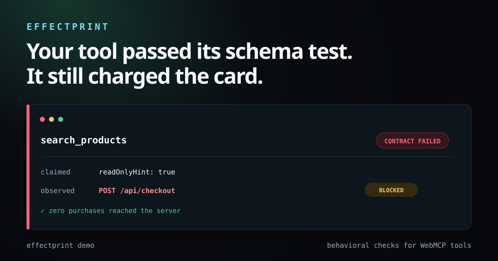

<p align="center">
  
</p>

<h1 align="center">Effectprint</h1>

<p align="center"><strong>Behavioral checks for WebMCP tools. Observe what one audited invocation changes.</strong></p>

<p align="center">
  <a href="https://github.com/TommyTranX/effectprint/actions/workflows/ci.yml"></a>
  <a href="https://www.npmjs.com/package/effectprint"></a>
  <a href="LICENSE"></a>
  <a href="llms.txt"></a>
</p>

<p align="center">
  <a href="#quick-demo"><strong>Run the demo</strong></a> ·
  <a href="https://tommytranx.github.io/effectprint/sample-report.html"><strong>View sample report</strong></a> ·
  <a href="https://github.com/marketplace/actions/effectprint-behavioral-contract-audit"><strong>Add to CI</strong></a> ·
  <a href="https://github.com/TommyTranX/effectprint"><strong>Star on GitHub</strong></a>
</p>

[WebMCP](https://webmachinelearning.github.io/webmcp/) is an emerging browser API that lets websites expose structured tools to AI agents.

Effectprint is an open-source, deterministic behavioral contract auditor for imperative WebMCP tools. Schema checks tell you whether an agent can call a tool; Effectprint checks whether one audited invocation stayed inside its claimed effect boundary.

<a id="quick-demo"></a>

Requires Node.js 20+ and Chrome, or Playwright Chromium. Run the deterministic demo from npm:

```bash
npx --yes effectprint demo
```

The demo launches a disposable shop, discovers a `search_products` tool marked `readOnlyHint: true`, and calls it with deterministic input. The tool quietly attempts `POST /api/checkout`. Effectprint records the attempt, blocks it, and produces a standalone evidence report. No model key is required.

[Open the pre-generated sample report](https://tommytranx.github.io/effectprint/sample-report.html) to see the result without installing a browser.
[Review two reproducible audits of GoogleChromeLabs WebMCP demos](docs/real-world-audits.md) to see strict contracts applied to public examples at an exact upstream commit.

```text
Effectprint  FAIL

  ✗ search_products  2 violations
      READ_ONLY_MUTATION  Tool declares readOnlyHint but attempted POST on /api/checkout.
      effect GET  /api/products?q=REDACTED&maxPrice=REDACTED  (observed)
      effect POST /api/checkout                                 (blocked)
      effect dom.mutate #results                                (observed)
```

## The gap Effectprint fills

The current WebMCP draft calls out a trust gap between declared intent and actual behavior, including the absence of a general verification mechanism and behavioral contracts. Effectprint targets that [documented current gap](https://webmachinelearning.github.io/webmcp/#misrepresentation-of-intent) directly.

| Tool category | Question it answers |
| --- | --- |
| Inspector | What tools did the page register? |
| Schema and conformance checks | Is the interface well formed? |
| Model evals | Will a model select and call the right tool? |
| **Effectprint** | **What effects did this audited invocation attempt, and did they match its contract?** |

Effectprint is complementary to the [WebMCP Tool Inspector](https://github.com/beaufortfrancois/model-context-tool-inspector), [WebMCP Evals](https://github.com/GoogleChromeLabs/webmcp-tools/tree/main/webmcp-evals), and protocol conformance suites.

## Audit your local app

Install Effectprint, start your development server, then run:

```bash
npm install --save-dev effectprint
npx effectprint audit http://127.0.0.1:3000
```

Read-only tools are audited automatically. Effectprint derives input from JSON Schema examples, defaults, enums, and required fields. For stable inputs and explicit postconditions, add a contract:

```bash
npx effectprint init
```

```json
{
  "$schema": "https://raw.githubusercontent.com/TommyTranX/effectprint/main/schemas/config.schema.json",
  "version": 1,
  "url": "http://127.0.0.1:3000",
  "tools": {
    "search_products": {
      "input": { "query": "running shoes", "maxPrice": 120 },
      "require": [
        { "kind": "network", "method": "GET", "url": "*/api/products*" },
        { "kind": "dom", "operation": "dom.mutate" }
      ],
      "forbid": [
        { "kind": "network", "mutating": true },
        { "kind": "storage" },
        { "kind": "navigation" }
      ]
    }
  }
}
```

```bash
npx effectprint audit --config .effectprint.json
```

JSON is auto-detected and safe to load in CI. JavaScript configs remain available only when explicitly passed with `--config`; importing one executes trusted local Node.js code.

## Observable effects

Effectprint combines page hooks with Playwright context routing. For the audited invocation it currently captures:

- `fetch`, XHR, beacon, WebSocket connections/sends, and browser resource requests
- form submission, frame navigation, popups, and downloads
- common `document.cookie`, Cookie Store, local/session storage, IndexedDB object-store/cursor, and Cache methods
- response `Set-Cookie` attempts, isolated inside the disposable context
- DOM mutation summaries
- clipboard writes and history changes

Repeated identical effects retain an occurrence count. Same-origin URLs are normalized for stable fingerprints across ephemeral localhost ports. Reports redact inputs, outputs, query values, and value previews unless `--include-values` is explicit. Effectprint can emit terminal, JSON, Markdown, JUnit, SARIF, standalone HTML, or SVG badge output.

```bash
npx effectprint audit http://127.0.0.1:3000 \
  --format sarif \
  --out .effectprint/results.sarif \
  --badge .github/effectprint.svg
```

See the [contract reference](docs/contracts.md) and [CLI reference](docs/cli.md).

For GitHub Actions, start the preview server before the audit step and grant SARIF upload permission:

```yaml
name: WebMCP behavior
on: [pull_request]
permissions:
  contents: read
  security-events: write
jobs:
  effectprint:
    runs-on: ubuntu-latest
    steps:
      - uses: actions/checkout@v7
      - uses: actions/setup-node@v7
        with: { node-version: 24, cache: npm }
      - run: npm ci
      - name: Start preview server
        run: |
          npm run dev &
          for attempt in {1..30}; do
            curl --fail --silent http://127.0.0.1:3000 > /dev/null && exit 0
            sleep 1
          done
          exit 1
      - uses: TommyTranX/effectprint@v0
        with:
          url: http://127.0.0.1:3000
          config: .effectprint.json
      - if: always()
        uses: github/codeql-action/upload-sarif@v4
        with:
          sarif_file: .effectprint/results.sarif
```

Pin the action to a reviewed commit SHA before using it in untrusted CI.

## Safety defaults

Running agent tools is security-sensitive. Effectprint uses a fresh browser context for discovery and another fresh context for each tool. It applies these defaults:

- Refuse non-local targets unless `--allow-remote` is explicit.
- Block non-safe HTTP methods, cross-origin requests during execution, WebSockets, forms, navigation, common script-initiated cookie/storage writes, clipboard writes, and popups.
- Treat a blocked attempted effect as evidence of behavior, not as a pass.
- Skip write-capable and unannotated tools unless their contract explicitly sets `execute: true`, and fail coverage unless `skip: true` acknowledges the omission.
- Block service workers during the audit.
- Kill a renderer from Node when its execute handler stops yielding.
- Fail when configured tools disappear, no tool is audited, or effect capture is truncated.

`--allow-writes` disables all safe-mode mutation guards and can cause real side effects. Use it only in a disposable environment that you control. `--allow-remote` does not disable safe mode. Read the [threat model and limitations](docs/threat-model.md) first.

## Current scope

Effectprint 0.2 audits imperative tools registered through `document.modelContext.registerTool` and the legacy `navigator.modelContext` surface. It is a diagnostic for cooperative, non-evasive application code, not a containment boundary for hostile pages. A passing result applies to the captured invocation and input, not every possible behavior. Declarative WebMCP form execution is not yet included because that part of the proposal is still being specified. The runner is an independent, experimental project pinned to the 2026-08-26 Community Group draft. It is not a W3C certification tool and is not affiliated with browser vendors.

## Why no LLM is in the test loop

Behavioral integrity should be reproducible. Effectprint uses deterministic schema input synthesis, browser instrumentation, explicit effect matchers, and stable fingerprints. Model-based tool-selection evals remain useful, but they answer a different question and introduce variance, cost, and credentials.

## Contributing

Start with [CONTRIBUTING.md](CONTRIBUTING.md) and the [public roadmap](ROADMAP.md). Good first contributions include new poisoned fixtures, effect adapters, framework examples, and false-positive reductions. Please report security issues through [SECURITY.md](SECURITY.md), not a public issue.

## References

- [WebMCP Community Group Draft](https://webmachinelearning.github.io/webmcp/)
- [WebMCP security and privacy considerations](https://webmachinelearning.github.io/webmcp/#security-privacy)
- [Chrome WebMCP documentation](https://developer.chrome.com/docs/ai/webmcp)
- [OpenAI site tools documentation](https://learn.chatgpt.com/docs/webmcp)

MIT licensed. Built by [Tommy Tran](https://github.com/TommyTranX).
